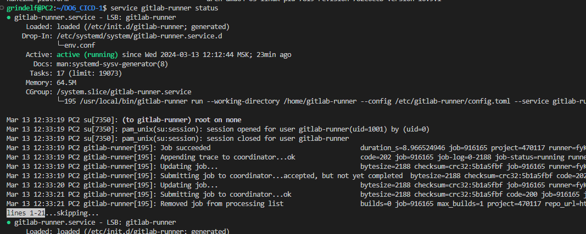
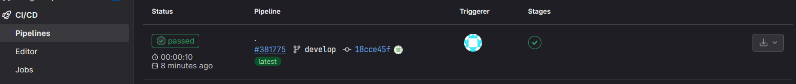
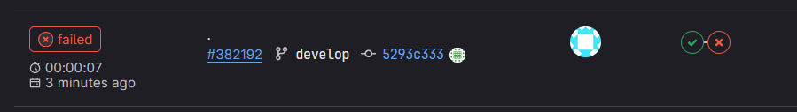
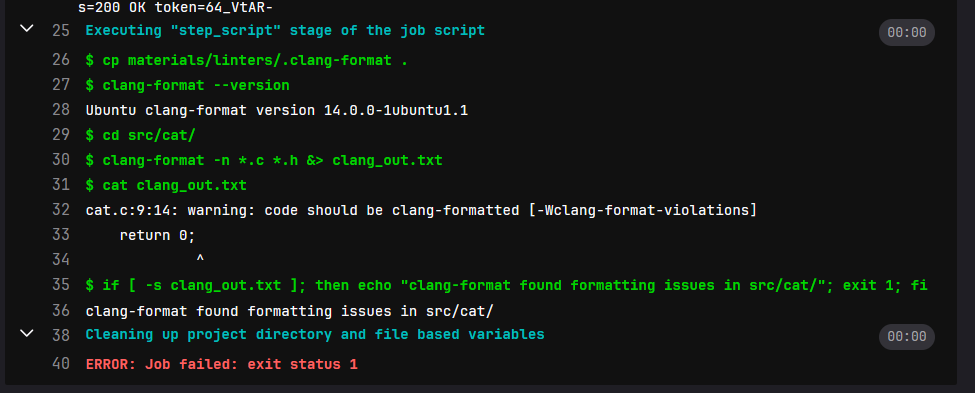
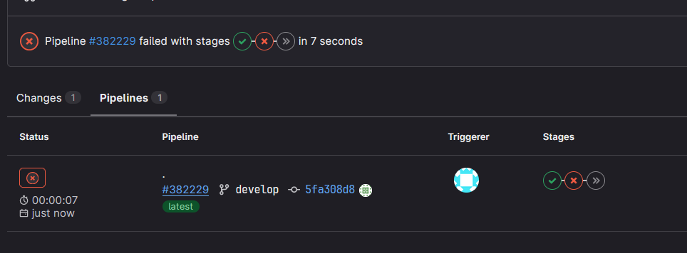
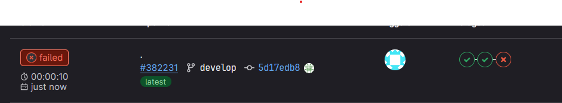
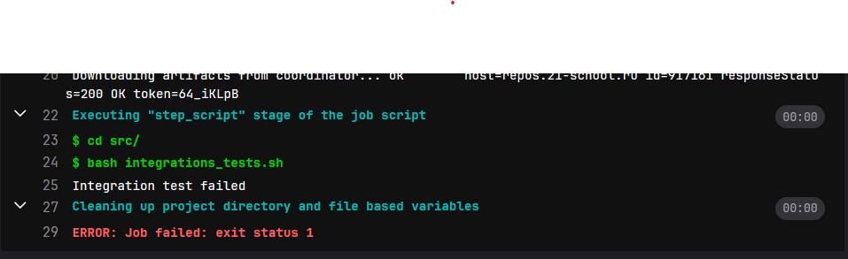
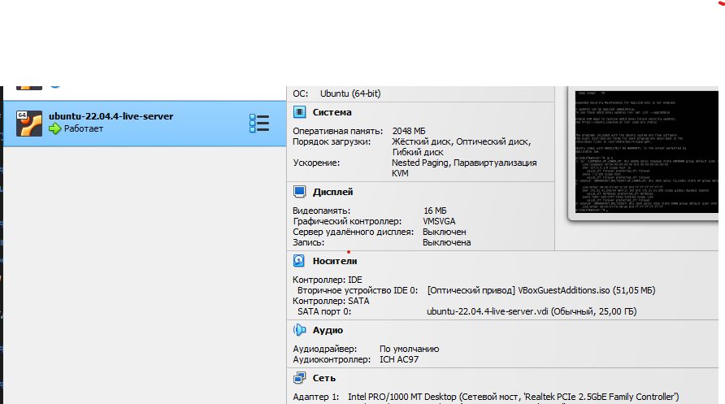
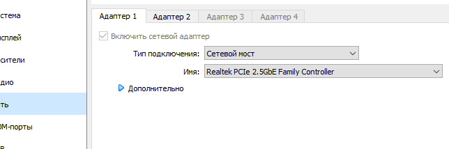
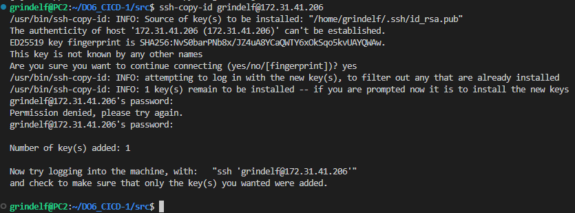

### Part 1. Настройка **gitlab-runner**

##### Подними виртуальную машину *Ubuntu Server 22.04 LTS*.

##### Скачай и установи на виртуальную машину **gitlab-runner**.

> sudo curl -L --output /usr/local/bin/gitlab-runner "https://gitlab-runner-downloads.s3.amazonaws.com/latest/binaries/gitlab-runner-linux-amd64" </br>

> sudo chmod +x /usr/local/bin/gitlab-runner </br>

> sudo useradd --comment 'GitLab Runner' --create-home gitlab-runner --shell /bin/bash </br>

> sudo gitlab-runner install --user=gitlab-runner --working-directory=/home/gitlab-runner </br>

> sudo gitlab-runner start </br>

> sudo systemctl enable --now gitlab-runner </br>


##### Запусти **gitlab-runner** и зарегистрируй его для использования в текущем проекте (*DO6_CICD*).
- Для регистрации понадобятся URL и токен, которые можно получить на страничке задания на платформе.

> sudo gitlab-runner register
```
    URL: https://repos.21-school.ru
    token: <your_token_from_the_platform>
    -
    tags: build,style,test,deploy,notify
    -
    executor: shell
```
> sudo gitlab-runner verify </br>
> sudo gitlab-runner run

Check status of the gitlab-runner with
> service gitlab-runner status



### Part 2. Сборка

#### Напиши этап для **CI** по сборке приложений из проекта *C2_SimpleBashUtils*.

##### В файле _gitlab-ci.yml_ добавь этап запуска сборки через мейк файл из проекта _C2_.

- Копируем папки из проекта C2_SimpleBashUtils, в _.gitlab-ci.yml_ указываем путь до makefile:


##### Файлы, полученные после сборки (артефакты), сохрани в произвольную директорию со сроком хранения 30 дней.

```
  artifacts:
    paths:
      - src/cat/s21_cat
      - src/grep/s21_grep
    expire_in: 30 days
```

 - Во вкладке CI/CD на gitlab в Pipelines после пуша появится результат сборки:

 

### Part 3. Тест кодстайла

#### Напиши этап для **CI**, который запускает скрипт кодстайла (*clang-format*).

- В ``stages:`` добаволяем ``-style``

```
style_test:
  stage: style
  tags: 
    - style
  script:
    - cp materials/linters/.clang-format .
    - clang-format --version
    - cd src/cat/ 
    - clang-format -n *.c *.h &> clang_out.txt
    - cat clang_out.txt
    - if [ -s clang_out.txt ]; then
        echo "clang-format found formatting issues in src/cat/";
        exit 1;
      fi
    - cd ../grep/
    - clang-format -n *.c *.h &> clang_out.txt
    - cat clang_out.txt
    - if [ -s clang_out.txt ]; then
        echo "clang-format found formatting issues in src/grep/";
        exit 1;
      fi
```

##### Если кодстайл не прошел, то «зафейли» пайплайн.

 

##### В пайплайне отобрази вывод утилиты *clang-format*.

 

### Part 4. Интеграционные тесты

#### Напиши этап для **CI**, который запускает твои интеграционные тесты из того же проекта.

- Добавим скрипт ``integrations_tests`` в ``src``, который вызывает тесты для cat и grep

```
#!/bin/bash

cd cat/
RESULT=$(bash test_cat.sh | grep "FAIL: 0")
if [ -z "$RESULT" ]; then
    echo 'Integration test failed';
    exit 1;
fi

cd ../grep/
RESULT=$(bash test_grep.sh | grep "FAIL: 0")
if [ -z "$RESULT" ]; then
    echo 'Integration test failed';
    exit 1;
fi
echo 'Integration test successful';
exit 0;
```

- В ``.gitlab-ci.yml`` добавляем стадию ``testing``. В ``stages:`` добаволяем ``-test``
```
testing:
  stage: test
  tags: 
    - test
  script:
  - cd src/
  - bash integrations_tests.sh
```
##### Запусти этот этап автоматически только при условии, если сборка и тест кодстайла прошли успешно.

 - Последующие стадии автоматически пропускается, если предыдущие зафейлены

 

##### Если тесты не прошли, то «зафейли» пайплайн.

 

##### В пайплайне отобрази вывод, что интеграционные тесты успешно прошли / провалились.

 

### Part 5. Этап деплоя

##### Подними вторую виртуальную машину *Ubuntu Server 22.04 LTS*.



#### Напиши этап для **CD**, который «разворачивает» проект на другой виртуальной машине.

- Устанавливаем сетевые адаптеры "сетевой мост"



- ывавып




##### Запусти этот этап вручную при условии, что все предыдущие этапы прошли успешно.

##### Напиши bash-скрипт, который при помощи **ssh** и **scp** копирует файлы, полученные после сборки (артефакты), в директорию */usr/local/bin* второй виртуальной машины.
*Тут тебе могут помочь знания, полученные в проекте DO2_LinuxNetwork.*

- Будь готов объяснить по скрипту, как происходит перенос.

##### В файле _gitlab-ci.yml_ добавь этап запуска написанного скрипта.

##### В случае ошибки «зафейли» пайплайн.

В результате ты должен получить готовые к работе приложения из проекта *C2_SimpleBashUtils* (s21_cat и s21_grep) на второй виртуальной машине.

##### Сохрани дампы образов виртуальных машин.
**P.S. Ни в коем случае не сохраняй дампы в гит!**
- Не забудь запустить пайплайн с последним коммитом в репозитории.

### Part 6. Дополнительно. Уведомления

`-` Здесь написано, что твое следующее задание выполняется специально для нобелевских лауреатов. Здесь не сказано, за что они получили премию, но точно не за умение работать с **gitlab-runner**.

**== Задание ==**

##### Настрой уведомления о успешном/неуспешном выполнении пайплайна через бота с именем «[твой nickname] DO6 CI/CD» в *Telegram*.

- Текст уведомления должен содержать информацию об успешности прохождения как этапа **CI**, так и этапа **CD**.
- В остальном текст уведомления может быть произвольным.


## Chapter IV

`-` Хорошо. По завершении серии заданий сотруднику следует пройти в комнату отдыха.

Пока у тебя выдалась свободная минутка в комнате отдыха, ты, попутно размышляя о странности происходящего, решаешь проверить почту.

Не успел ты достать телефон, как в комнату отдыха зашёл ещё один человек.

`-` Привет, что-то я тебя тут раньше не видел.

`-` Было бы странно, если бы видел. Я тут первый день, хах.

`-` О, первый день! Ну и как тебе наш «босс»? - последние слова прозвучали с явной иронией.

`-` Это был босс? Фух, всё-таки он не одному мне кажется странным... и слегка грубым? Я уж думал, что вы все в Англии такие.

`-` Ахах, ни в коем случае, друг. Это просто розыгрыш для новичков, но не волнуйся, завтра всё будет в порядке. Кстати говоря, вон идет и настоящий босс, кажется, как раз к тебе. Ну, удачи, свидимся еще.

Незнакомец быстро пропал и в комнату зашел невысокий мужчина в дорогом костюме, с небольшой залысиной, навскидку лет этак 50-60 лет. Не дожидаясь твоих слов, он с тонкой, едва уловимой улыбкой произнес:

`-` Ах, вы, видимо, Томас. Поистине великолепное выполнение тестовой работы. Надеюсь, вы не испугались нашей милой подруги ASI младшей, она высоко отозвалась о вас. Итак, позвольте мне подробнее рассказать чем мы тут вообще занимаемся и какова ваша роль в нашей компании...


💡 [Нажми сюда](https://forms.yandex.ru/cloud/641819b3c09c022518e7a4f3/), **чтобы поделиться с нами обратной связью на этот проек**т. Это анонимно и поможет команде Продукта сделать твоё обучение лучше.
