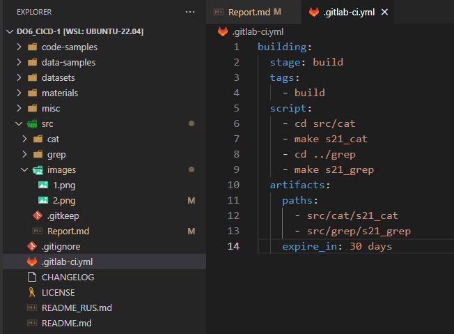
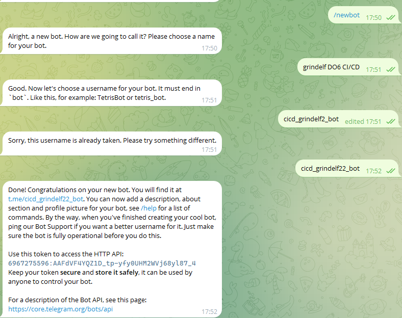

### Part 1. Настройка **gitlab-runner**

##### Подними виртуальную машину *Ubuntu Server 22.04 LTS*.

##### Скачай и установи на виртуальную машину **gitlab-runner**.

> sudo curl -L --output /usr/local/bin/gitlab-runner "https://gitlab-runner-downloads.s3.amazonaws.com/latest/binaries/gitlab-runner-linux-amd64" </br>

> sudo chmod +x /usr/local/bin/gitlab-runner </br>

> sudo useradd --comment 'GitLab Runner' --create-home gitlab-runner --shell /bin/bash </br>

> sudo gitlab-runner install --user=gitlab-runner --working-directory=/home/gitlab-runner </br>

> sudo gitlab-runner start </br>

> sudo systemctl enable --now gitlab-runner </br>


##### Запусти **gitlab-runner** и зарегистрируй его для использования в текущем проекте (*DO6_CICD*).
- Для регистрации понадобятся URL и токен, которые можно получить на страничке задания на платформе.

> sudo gitlab-runner register
```
    URL: https://repos.21-school.ru
    token: <your_token_from_the_platform>
    -
    tags: build,style,test,deploy,notify
    -
    executor: shell
```
> sudo gitlab-runner verify </br>
> sudo gitlab-runner run

Check status of the gitlab-runner with
> service gitlab-runner status


### Part 2. Сборка

#### Напиши этап для **CI** по сборке приложений из проекта *C2_SimpleBashUtils*.

##### В файле _gitlab-ci.yml_ добавь этап запуска сборки через мейк файл из проекта _C2_.

- Копируем папки из проекта C2_SimpleBashUtils, в _.gitlab-ci.yml_ указываем путь до makefile:



##### Файлы, полученные после сборки (артефакты), сохрани в произвольную директорию со сроком хранения 30 дней.

```
  artifacts:
    paths:
      - src/cat/s21_cat
      - src/grep/s21_grep
    expire_in: 30 days
```

 - Во вкладке CI/CD на gitlab в Pipelines после пуша появится результат сборки:

 

### Part 3. Тест кодстайла

#### Напиши этап для **CI**, который запускает скрипт кодстайла (*clang-format*).

- В ``stages:`` добаволяем ``-style``

```
style_test:
  stage: style
  tags: 
    - style
  script:
    - cp materials/linters/.clang-format .
    - clang-format --version
    - cd src/cat/ 
    - clang-format -n *.c *.h &> clang_out.txt
    - cat clang_out.txt
    - if [ -s clang_out.txt ]; then
        echo "clang-format found formatting issues in src/cat/";
        exit 1;
      fi
    - cd ../grep/
    - clang-format -n *.c *.h &> clang_out.txt
    - cat clang_out.txt
    - if [ -s clang_out.txt ]; then
        echo "clang-format found formatting issues in src/grep/";
        exit 1;
      fi
```

##### Если кодстайл не прошел, то «зафейли» пайплайн.

 

##### В пайплайне отобрази вывод утилиты *clang-format*.

 

### Part 4. Интеграционные тесты

#### Напиши этап для **CI**, который запускает твои интеграционные тесты из того же проекта.

- Добавим скрипт ``integrations_tests`` в ``src``, который вызывает тесты для cat и grep

```
#!/bin/bash

cd cat/
RESULT=$(bash test_cat.sh | grep "FAIL: 0")
if [ -z "$RESULT" ]; then
    echo 'Integration test failed';
    exit 1;
fi

cd ../grep/
RESULT=$(bash test_grep.sh | grep "FAIL: 0")
if [ -z "$RESULT" ]; then
    echo 'Integration test failed';
    exit 1;
fi
echo 'Integration test successful';
exit 0;
```

- В ``.gitlab-ci.yml`` добавляем стадию ``testing``. В ``stages:`` добаволяем ``-test``
```
testing:
  stage: test
  tags: 
    - test
  script:
  - cd src/
  - bash integrations_tests.sh
```
##### Запусти этот этап автоматически только при условии, если сборка и тест кодстайла прошли успешно.

 - Последующие стадии автоматически пропускается, если предыдущие зафейлены

 

##### Если тесты не прошли, то «зафейли» пайплайн.

 

##### В пайплайне отобрази вывод, что интеграционные тесты успешно прошли / провалились.

 

### Part 5. Этап деплоя

##### Подними вторую виртуальную машину *Ubuntu Server 22.04 LTS*.


#### Напиши этап для **CD**, который «разворачивает» проект на другой виртуальной машине.

- Устанавливаем сетевые адаптеры "сетевой мост"


- При помощи команды ``ssh <имя_пользователя>@<публичный_IP-адрес_ВМ>`` устанавливаем соединение со 2й машиной
- Для пользователя 2й ВМ выполняем команду ``chown <имя_пользователя> /usr/local/bin``, чтобы пользователь стал владельцом директории и не возникало ошибок с доступом при копировании файлов


##### Запусти этот этап вручную при условии, что все предыдущие этапы прошли успешно.


##### Напиши bash-скрипт, который при помощи **ssh** и **scp** копирует файлы, полученные после сборки (артефакты), в директорию */usr/local/bin* второй виртуальной машины.

```
#!/bin/bash

REMOTE_HOST="172.31.41.206"
REMOTE_USER="grindelf"
REMOTE_DIR="/usr/local/bin"

scp -o StrictHostKeyChecking=no cat/s21_cat grep/s21_grep $REMOTE_USER@$REMOTE_HOST:/tmp/

if [ $? -ne 0 ]; then
  echo "Ошибка при копировании файлов"
  exit 1
fi

ssh -o StrictHostKeyChecking=no $REMOTE_USER@$REMOTE_HOST "mv /tmp/s21_cat $REMOTE_DIR; mv /tmp/s21_grep $REMOTE_DIR"

if [ $? -ne 0 ]; then
  echo "Ошибка при перемещении файлов"
  exit 1
fi

echo "Файлы успешно скопированы"
```

##### В файле _gitlab-ci.yml_ добавь этап запуска написанного скрипта.

- В ``stages:`` добаволяем ``-deploy``

```
deploying:
  stage: deploy
  tags:
    - deploy
  script:
    - chmod 777 src/deploy.sh
    - bash src/deploy.sh
  when: manual
```

##### В случае ошибки «зафейли» пайплайн.


В результате ты должен получить готовые к работе приложения из проекта *C2_SimpleBashUtils* (s21_cat и s21_grep) на второй виртуальной машине.


### Part 6. Дополнительно. Уведомления

##### Настрой уведомления о успешном/неуспешном выполнении пайплайна через бота с именем «[твой nickname] DO6 CI/CD» в *Telegram*.

- Создаем бота в Телеграм с помощью BotFather:



- Далее создадим скрипт notify.sh:
```
#!/bin/bash

TELEGRAM_API_TOKEN="6967275596:AAFdVF4YQZ1D_tp-yfy0UHM2WVj68yl87_4"
CHAT_ID="323815524"

URL="https://api.telegram.org/bot$TELEGRAM_API_TOKEN/sendMessage"
TEXT="Deploy status: $1%0AProject name: $CI_PROJECT_NAME%0AURL: $CI_PROJECT_URL/pipelines/$CI_PIPELINE_ID/"

curl -s -d "chat_id=$CHAT_ID&disable_web_page_preview=1&text=$TEXT" $URL > /dev/null
```
- - TELEGRAM_API_TOKEN получаем у BotFather
- - CHAT_ID можно получить открыв в браузере ``https://api.telegram.org/bot<YOUR_BOT_TOKEN>/getUpdates``. Тут будет указан id чата


- -В ``stages:`` добаволяем ``-notify``
```
notification:
  stage: notify
  tags: 
    - notify
  script:
  - cd src/
  - bash notify.sh ALL STAGES COMPLETE
```
